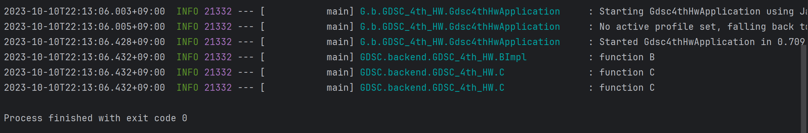

# DI와 Spring Boot

## DI (의존성 주입)

1. **DI란?**
    - 외부에서 두 객체 간의 관계를 결정해주는 디자인 패턴
    - 인터페이스를 사이에 두어 클래스 레벨에서 의존관계가 고정되지 않도록 해줌
    - 런타임 시 관계를 동적으로 주입하여 유연성을 확보하고 결합도를 낮출 수 있게 해줌

2. **DI의 네 가지 방법**
    - 기본적으로 의존성 주입은 `@Autowired` 어노테이션을 사용

    1. 생성자 주입
        - 생성자를 통해 의존관계를 주입하는 방법
        - 객체의 최초 생성 시점에 스프링이 의존성을 주입함
        - 주입받는 객체가 변하지 않거나 반드시 객체의 주입이 필요한 경우 사용
  
    2. 수정자(setter) 주입
        - setter 메서드를 통해 의존관계를 주입하는 방법
        - 선택, 변경 가능성이 있는 의존관계에 사용함
        - 파이널 필드를 만들 수 없고 의존성의 불변을 보장할 수 없음

    3. 필드 주입
        - 필드에 바로 주입하는 방법
        - 생성자, setter가 없으므로 수동 의존성을 주입할 수 없음
        - 의존성이 프레임워크에 강하게 종속되는 문제
        - 상기한 문제로 인해 테스트 코드 등 특별한 경우에만 사용
  
    4. 일반 메서드 주입
        - 한번에 여러 필드를 주입받을 수 있으나 일반적으로 잘 사용하지 않음

3. **DI 주의점**
    - NullPointerException 방지
        - 필드 주입이나 setter 주입의 경우 스프링의 빈 관리 기능을 빌리지 않고 new 키워드로 객체를 생성해 줄 경우 NullPointerException이 발생할 수 있음
        -> 빈 생성자를 사용해 기본적으로 의존성이 없는 상태이기 때문
        - 그러나 생성자 주입은 (완전한 생성자라는 가정 하에) 객체 생성 시점에 모든 의존성을 주입해주므로 Null을 의도적으로 넣어주지 않는 한 NullPointerException이 발생할 수 없음
    
   - 순환참조 문제 방지
        - 필드 주입이나 setter 주입을 통해 의존성을 주입하게 되면 A 객체가 B 객체를 의존하는데 B 객체 또한 A 객체를 의존할 때 생기는 순환참조가 발생할 수 있음 
        - 그러나 생성자 주입을 사용하는 객체들끼리 의존성이 순환되면 스프링은 에러 메시지와 함께 프로그램을 종료함

4. **주입 대상이 여러 개일 경우**
    - 타입을 1순위, 변수명을 2순위로 기준을 정함
    - `@Qualifier` 또는 `@Primary` 어노테이션을 이용할수 있음
    - 의존성 주입에 대한 우선순위
      - 타입 -> `@Qualifier` -> `@Primary` -> 변수명

5. **Lombok 라이브러리**
    - 반복적인 코드를 줄이는데 도음을 주는 어노테이션 기반의 도구를 제공
    - getter, setter, equals, hashCode 및 toString 메서드 등을 Lombok의 어노테이션을 사용하여 자동으로 생성할 수 있음
    - 롬북이 제공하는 생성자
      - `@NoArgsConstructor` : 파라미터가 없는 기본 생성자를 생성
      - `@RequiredArgsConstructor` : `final` 또는 `@NonNull`로 표시된 필드만을 파라미터로 하는 생성자를 생성
      - `@AllArgsConstructor` : 모든 필드 값을 파라미터로 받는 생성자를 생성

## Spring Boot

1. **스프링 부트란?**
    - 스프링 기반의 어플리케이션을 빠르게 개발하고 실행하기 위한 프레임워크
    - 개발에 필요한 복잡한 설정을 스프링 부트가 대신 해줌으로써 개발자의 편리한 스프링 사용에 도움을 줌

2. **스프링 부트의 특징**
   1. WAS
      - Tomcat 같은 웹 서버를 내장하고 있어 별도의 웹 서버를 설치하지 않아도 됨
    
   2. 라이브러리 관리
      - 손쉬운 빌드 구성을 위한 스타터 종속성 제공 및 라이브러리 버전 관리
    
   3. 자동 구성
      - 프로젝트 시작에 필요한 스프링과 외부 라이브러리의 빈을 자동 등록
      - 스프링 애플리케이션에 공통으로 필요한 애플리케이션 기능을 자동으로 구성

   4. 외부 설정
      - 환경에 따라 달라져야 하는 외부 설정 공통화
    
   5. 프로덕션 준비
      - 모니터링을 위한 메트릭, 상태 확인 기능 제공
        - 스프링 애플리케이션 컨텍스트에 구성된 빈
        - 스프링 부트의 자동 구성으로 구성된 것
        - 애플리케이션에서 사용할 수 있는 환경 변수, 시스템 프로퍼티, 구성 프로퍼티, 명령줄 인자
        - 최근에 처리된 HTTP 요청 정보
        - 메모리 사용량, 가비지 컬렉션, 웹 요청, 데이터 소스 사용량 등 다양한 메트릭

## Week4 과제 로그

